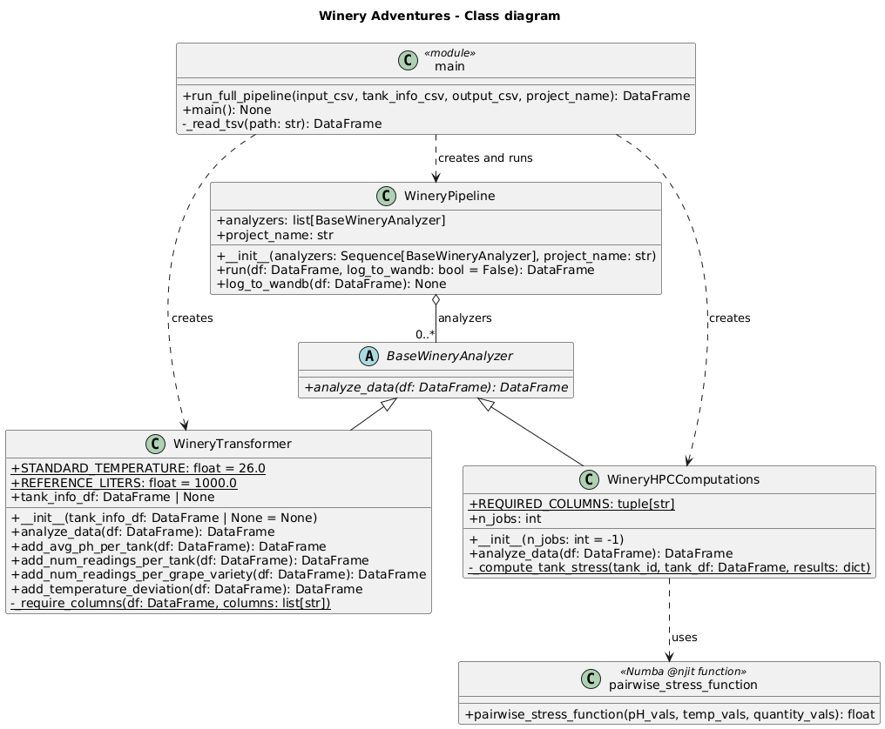
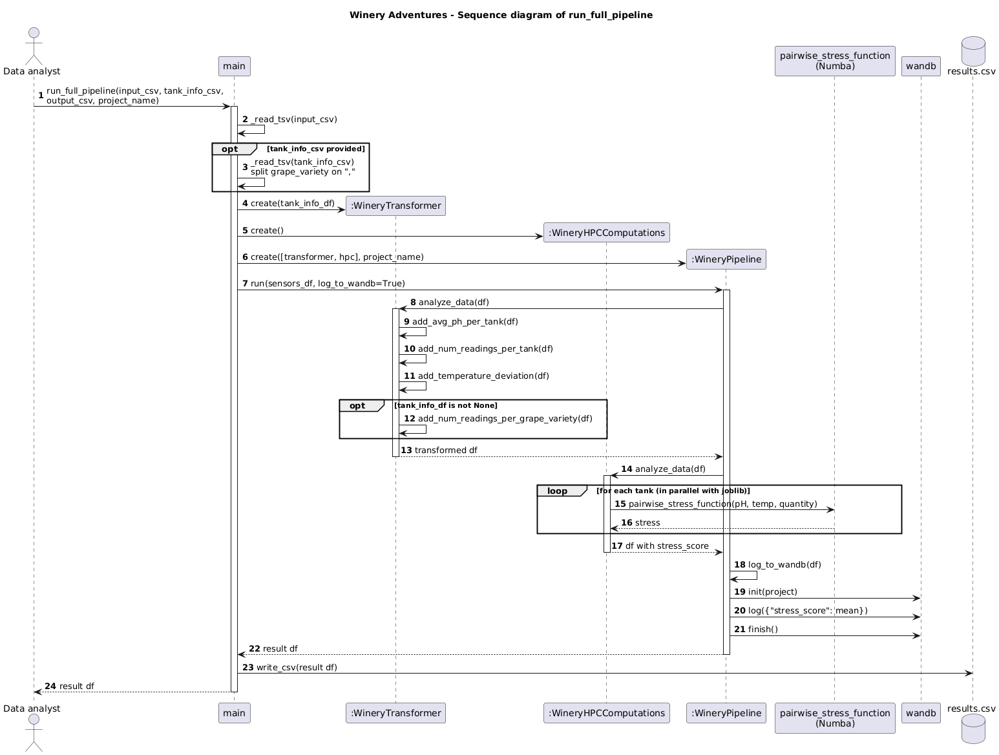
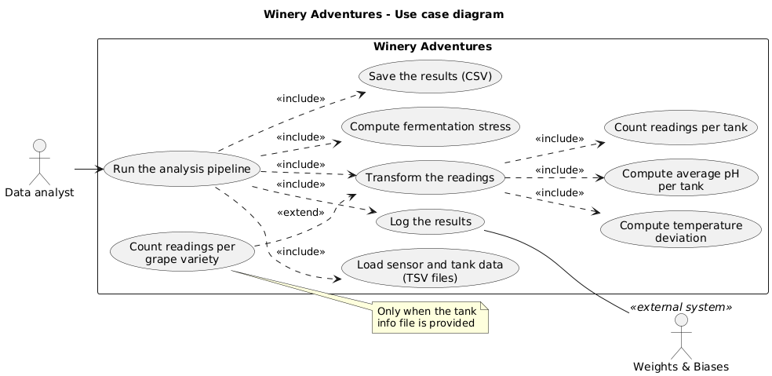

Design
======

The system is built around one abstract class, ``BaseWineryAnalyzer``, that
defines a single operation: ``analyze_data``, which takes a Polars DataFrame
and returns a transformed DataFrame. ``WineryTransformer`` and
``WineryHPCComputations`` implement it, and ``WineryPipeline`` applies a list
of analyzers in sequence and logs the result to Weights & Biases.

The UML sources (PlantUML) are in ``docs/uml``.

Class diagram
-------------

Sequence diagram
----------------

The flow of ``run_full_pipeline``, from the reading of the files to the
writing of the results.

Use case diagram
----------------

Development workflow
--------------------

* Work on a branch (``feature/...``, ``docs/...``, ``chore/...``), never on ``main``.
* Open a pull request: the CI runs ruff (lint and format check) and pytest,
  and another member of the team reviews the code.
* Every function, method and class needs a docstring in Google style
  (description, ``Args``, ``Returns``, ``Raises``).
